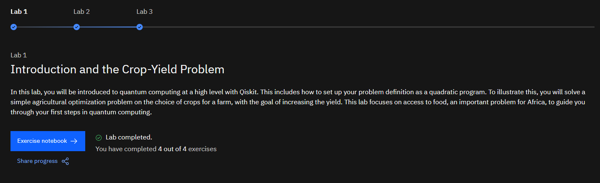
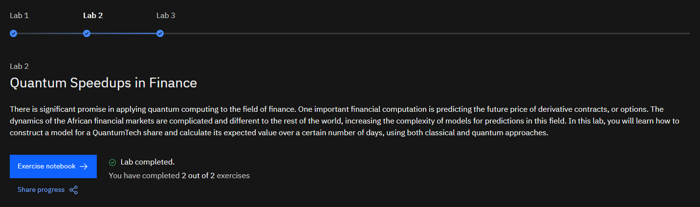
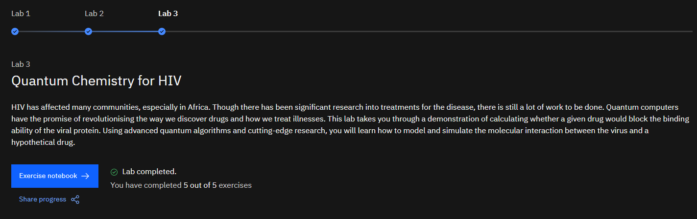

# IBM-Quantum-Challenge-Africa-2021
Lab work of IBM Quantum Challenge Africa 2021

---

| Lab-1 | https://nbviewer.jupyter.org/github/ashishpatel26/IBM-Quantum-Challenge-Africa-2021/blob/main/Lab1/lab1.ipynb |
| ----- | ------------------------------------------------------------ |

---
---

| Lab-2 | https://nbviewer.jupyter.org/github/ashishpatel26/IBM-Quantum-Challenge-Africa-2021/blob/main/Lab2/lab2.ipynb |
| ----- | ------------------------------------------------------------ |

---
---

| Lab-3 | https://nbviewer.jupyter.org/github/ashishpatel26/IBM-Quantum-Challenge-Africa-2021/blob/main/Lab3/lab3.ipynb |
| ----- | ------------------------------------------------------------ |

---

**Thanks for reading**

----

**References :**

[1] https://challenges.quantum-computing.ibm.com/africa21
